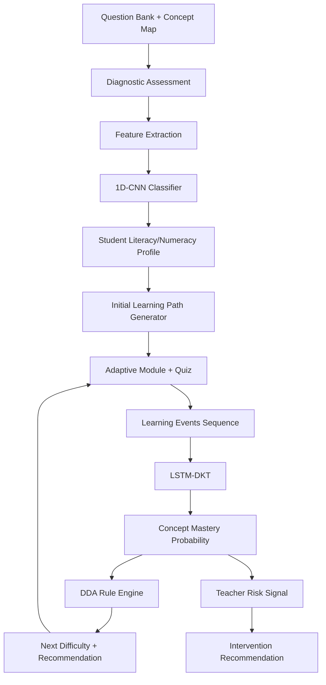

# AI Workflow

## 1. AI Scope

AI LITERA-AI adalah predictive analytics, bukan generative AI. Sistem tidak menghasilkan teks bebas sebagai tutor generatif. AI dipakai untuk:

- Klasifikasi profil literasi/numerasi dengan 1D-CNN.
- Deep Knowledge Tracing dengan LSTM-DKT.
- Dynamic Difficulty Adjustment berbasis aturan yang memakai output DKT.
- Sinyal rekomendasi intervensi guru.

## 2. Data Sources

| Source | Usage | Privacy |
| --- | --- | --- |
| Public datasets seperti ASSISTments/EdNet | Pretraining, arsitektur baseline, eksperimen sequence model. | Tidak berisi PII lokal. |
| Synthetic PISA/TKA-style data | Menambah variasi profil dan difficulty saat development. | Tidak memakai data siswa nyata. |
| Pilot school data | Fine-tuning/evaluasi konteks Riau/Indonesia. | Wajib consent dan anonimisasi. |

## 3. End-to-End Pipeline



## 4. 1D-CNN Diagnostic Classifier

### Input Features

Per diagnostic session:

- Correctness vector per concept.
- Response time normalized per question.
- Difficulty level per question.
- Domain marker: literacy/numeracy/STEM context.
- Attempt sequence position.
- Confidence/skip indicators jika tersedia.

### Output

- `literacy_profile`: `mechanical_reader`, `developing_reader`, `critical_reader`.
- `numeracy_profile`: `procedural`, `transitional`, `logical_contextual`.
- `confidence`: 0..1.
- `feature_summary`: ringkasan sinyal untuk audit pedagogis.

### Training

- Split train/validation/test: 70/15/15.
- K-fold cross-validation: k=5.
- SMOTE atau class-weight untuk imbalance.
- Baseline comparison: logistic regression, random forest, Bayesian Knowledge Tracing untuk sequence baseline.
- Metrics: F1 macro, F1 weighted, AUC, confusion matrix per profil.

## 5. LSTM Deep Knowledge Tracing

### Input Sequence

Event sequence per student:

```text
(concept_id, question_id, difficulty, correctness, response_time_bucket, timestamp_delta)
```

### Output

- Probability siswa menjawab benar pada konsep berikutnya.
- Mastery probability per concept.
- Confidence per prediction.

### Training

- Loss: binary cross-entropy.
- Optimizer: Adam.
- Sequence padding/masking.
- Evaluation: AUC, F1, calibration curve, per-concept performance.

## 6. Dynamic Difficulty Adjustment

DDA adalah rule engine transparan yang memakai output LSTM-DKT dan perilaku terbaru siswa.

### Signals

- Mastery probability.
- Confidence.
- Recent correctness streak.
- Response time trend.
- Number of hints/checkpoint retries.
- Difficulty history.

### Rules v1

| Condition | Decision |
| --- | --- |
| Mastery >= 0.80 and recent correctness >= 80% and response time normal | Increase difficulty by one level. |
| Mastery 0.55..0.79 | Keep difficulty and continue practice. |
| Mastery < 0.55 or two consecutive incorrect answers | Decrease difficulty or send remediation module. |
| Confidence low | Keep difficulty and collect more evidence. |
| Response time very high with correct answers | Keep difficulty and recommend worked example. |

### Difficulty Levels

1. `foundation`
2. `easy`
3. `medium`
4. `hard`
5. `advanced`

## 7. Model Serving

MVP serving:

- FastAPI AI service loads active model versions at startup.
- Model metadata comes from `model_versions`.
- Inference endpoint is internal application service, not public unauthenticated API.
- Result always stores model version and latency.

Edge option:

- Convert 1D-CNN to TensorFlow Lite.
- Quantize model if accuracy drop is acceptable.
- Ship model with checksum and remote config version.
- Use backend fallback when TFLite unavailable.

## 8. AI Audit and Explainability

Every inference stores:

- Model type.
- Model version.
- Input schema version.
- Latency ms.
- Confidence.
- Decision output.
- Redacted feature summary.

Teacher-facing explanation must be plain language:

- "Siswa sering benar pada soal prosedural, tetapi lambat dan tidak stabil pada soal konteks."
- "Konsep inferensi teks perlu remedial karena mastery probability 0.42 dan dua quiz terakhir menurun."

## 9. AI Quality Gates

| Gate | Target |
| --- | --- |
| Diagnostic F1 macro | >= 0.85 before production claim. |
| Inference latency | <= 200 ms target on benchmark environment. |
| Calibration | Prediction confidence should not be systematically overconfident. |
| Bias check | Evaluate by grade, school, gender if data consent allows. |
| Regression | New model cannot reduce F1 by > 2% without approval. |

## 10. Human-in-the-Loop

- Guru menerima rekomendasi, bukan perintah otomatis.
- Rekomendasi intervensi dapat ditandai `accepted`, `ignored`, atau `completed`.
- Feedback guru menjadi data evaluasi rekomendasi setelah dianonimkan.

## 11. Safety Boundaries

- AI tidak memberi diagnosis psikologis/medis.
- AI tidak menentukan kelulusan siswa.
- AI tidak membuat konten bebas tanpa review pedagogis.
- Data anak harus mengikuti consent, minimization, anonymization, dan audit access.
