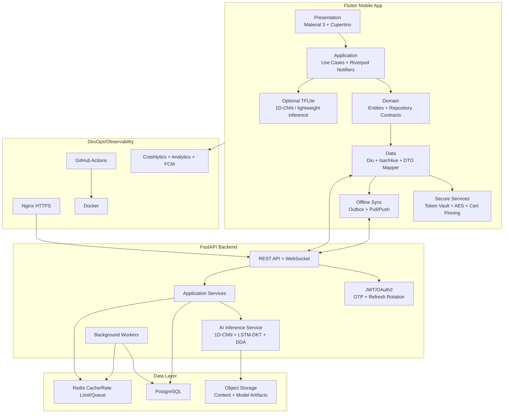
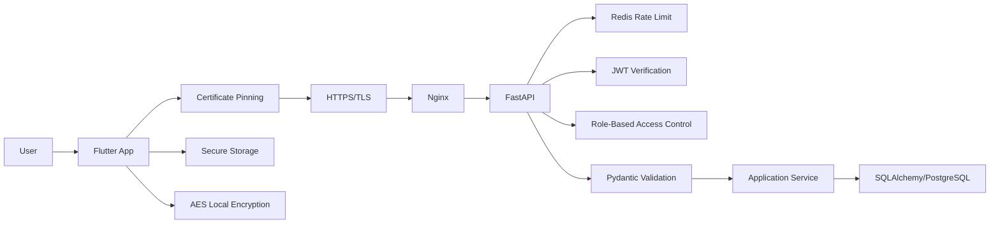

# System Architecture

## 1. Architecture Style

LITERA-AI memakai Clean Architecture, feature-first modularization, repository pattern, dependency injection, dan event-driven sync untuk mendukung mobile offline first.

Lapisan mobile:

- Presentation: screen, widget, controller/provider, route guard.
- Application: use case orchestration, app services, command/query handlers.
- Domain: entity, value object, repository contract, domain service.
- Data: DTO, mapper, API client, local datasource, remote datasource.
- Core: networking, storage, errors, logging, security, config.
- Shared: reusable UI atoms, molecules, layouts, extensions.
- Services: analytics, notification, sync, model inference, crash reporting.

Lapisan backend:

- API routers.
- Application services.
- Domain model.
- Infrastructure repositories.
- AI inference services.
- Async jobs.
- Observability and security middleware.

## 2. High-Level Diagram

## 3. Runtime Flow

1. App boot membaca secure session dan local app state.
2. Route guard menentukan onboarding, auth, OTP, profile, assessment, atau dashboard.
3. Semua screen memanggil Riverpod notifier.
4. Notifier memanggil use case.
5. Use case memanggil repository contract.
6. Repository memilih local datasource, remote datasource, atau keduanya.
7. Remote call memakai Dio interceptor untuk auth, retry, refresh token, logging, dan certificate pinning.
8. Local write memakai Isar untuk data relasional lokal dan Hive untuk cache sederhana/non-relasional.
9. Sync service mengirim outbox saat internet tersedia.
10. Backend memvalidasi input, menjalankan business rules, menyimpan event, dan memanggil AI service jika diperlukan.

## 4. Backend Components

| Component | Responsibility |
| --- | --- |
| Auth API | Register, login, OTP, refresh, logout, role guard. |
| User/Profile API | Profil siswa/guru/admin dan preferensi. |
| Assessment API | Diagnostic session, answer, submit, result. |
| Learning API | Learning path, module, content, progress. |
| Quiz API | Adaptive quiz session, answer, submit. |
| AI API/Internal Service | 1D-CNN classification, LSTM-DKT update, DDA decision. |
| Teacher API | Classroom dashboard, risk list, interventions. |
| Sync API | Pull delta, push outbox events, conflict resolution. |
| Notification API | Device token, notification preferences. |
| WebSocket | Progress live updates untuk guru. |

## 5. Data Strategy

- PostgreSQL adalah source of truth.
- Redis dipakai untuk cache, rate limiting, OTP TTL, websocket fanout, dan job queue ringan.
- Isar menyimpan data offline yang membutuhkan query lokal cepat.
- Hive menyimpan cache key-value, flags onboarding, dan lightweight metadata.
- Secure Storage menyimpan token dan key material.
- Model artifacts disimpan dengan versioning dan checksum.

## 6. AI Deployment Strategy

- MVP: backend inference sebagai default agar model dapat diupdate cepat.
- Optional edge: TFLite untuk 1D-CNN diagnostic jika model kecil dan perangkat mampu.
- LSTM-DKT sebaiknya backend-side pada MVP karena membutuhkan sequence state konsisten.
- DDA rule engine dapat berjalan di backend dan sebagian di mobile untuk preview lokal.

## 7. Security Architecture

## 8. Scalability

- Stateless API instances behind Nginx/load balancer.
- Redis for shared rate limit and cache.
- Horizontal workers for AI batch/evaluation jobs.
- Separate model service if inference load grows.
- Pagination for all list APIs.
- CDN/object storage for static content.

## 9. Observability

- Mobile: Firebase Crashlytics, Analytics, structured logs redacted from PII.
- Backend: request id, structured JSON logs, metrics, tracing, health checks.
- AI: model version, latency, input schema version, confidence, decision audit.
- Sync: event id, idempotency key, retry count, conflict result.

## 10. Architecture Decisions

| Decision | Rationale |
| --- | --- |
| Flutter for mobile | Single codebase for Android/iOS with Material 3 and Cupertino adaptation. |
| Riverpod | Predictable dependency injection and testable state management. |
| GoRouter | Declarative routing and route guards for auth/profile/assessment. |
| Isar + Hive | Isar for offline entities/query; Hive for simple cache and flags. |
| FastAPI | Strong typing, OpenAPI generation, async support. |
| PostgreSQL | Relational consistency for learning records and audit. |
| Redis | Rate limit, cache, OTP TTL, queue, websocket state. |
| Backend AI first | Easier iteration, audit, and model version control during pilot. |
