# Database Design and ERD

## 1. Database Principles

- PostgreSQL menjadi source of truth.
- Semua tabel memakai UUID primary key.
- Semua tabel penting memiliki `created_at`, `updated_at`, dan soft delete jika relevan.
- Event belajar disimpan append-only untuk audit dan training data.
- PII dipisahkan dari event pembelajaran sejauh mungkin.
- Semua akses guru dibatasi oleh relasi classroom membership.
- Mobile offline sync memakai event idempotency key.

## 2. Core Tables

### Identity

| Table | Purpose |
| --- | --- |
| users | Akun dasar dan role utama. |
| auth_sessions | Refresh token family, revocation, device metadata. |
| email_otps | OTP verifikasi email dengan TTL. |
| student_profiles | Profil siswa. |
| teacher_profiles | Profil guru. |
| schools | Sekolah. |
| classrooms | Kelas belajar. |
| classroom_members | Relasi siswa/guru ke kelas. |

### Learning

| Table | Purpose |
| --- | --- |
| concepts | Konsep literasi/numerasi. |
| learning_modules | Modul pembelajaran. |
| module_contents | Unit konten dalam modul. |
| questions | Bank soal. |
| question_options | Pilihan jawaban. |
| diagnostic_sessions | Sesi asesmen diagnostik. |
| diagnostic_answers | Jawaban asesmen. |
| diagnostic_results | Hasil klasifikasi 1D-CNN. |
| learning_paths | Jalur belajar siswa. |
| learning_path_items | Modul/konsep dalam jalur belajar. |
| quiz_sessions | Sesi quiz adaptif. |
| quiz_answers | Jawaban quiz. |
| learning_events | Event append-only dari aktivitas siswa. |
| concept_mastery | Snapshot penguasaan konsep per siswa. |
| dda_decisions | Keputusan difficulty adjustment. |
| intervention_recommendations | Rekomendasi guru untuk siswa. |

### Platform

| Table | Purpose |
| --- | --- |
| sync_events | Event offline dari mobile untuk idempotency. |
| device_tokens | FCM token dan metadata device. |
| audit_logs | Audit akses dan perubahan data sensitif. |
| model_versions | Metadata model AI. |
| model_inference_logs | Log inferensi teredaksi untuk evaluasi. |

## 3. Entity Relationship Diagram

```mermaid
erDiagram
  USERS {
    uuid id PK
    text email UK
    text password_hash
    text role
    boolean email_verified
    timestamptz created_at
    timestamptz updated_at
  }

  STUDENT_PROFILES {
    uuid id PK
    uuid user_id FK
    uuid school_id FK
    text grade_level
    text learning_preference
    date birth_date
    timestamptz completed_at
  }

  TEACHER_PROFILES {
    uuid id PK
    uuid user_id FK
    uuid school_id FK
    text subject_area
    timestamptz completed_at
  }

  SCHOOLS {
    uuid id PK
    text name
    text city
    text province
  }

  CLASSROOMS {
    uuid id PK
    uuid school_id FK
    text name
    text academic_year
    uuid created_by FK
  }

  CLASSROOM_MEMBERS {
    uuid id PK
    uuid classroom_id FK
    uuid user_id FK
    text member_role
  }

  CONCEPTS {
    uuid id PK
    text code UK
    text domain
    text name
    text description
  }

  LEARNING_MODULES {
    uuid id PK
    uuid concept_id FK
    text title
    text difficulty
    text status
    int estimated_minutes
  }

  MODULE_CONTENTS {
    uuid id PK
    uuid module_id FK
    text content_type
    int sort_order
    jsonb body
    text asset_url
  }

  QUESTIONS {
    uuid id PK
    uuid concept_id FK
    text question_type
    text difficulty
    text stem
    jsonb metadata
  }

  QUESTION_OPTIONS {
    uuid id PK
    uuid question_id FK
    text label
    text body
    boolean is_correct
  }

  DIAGNOSTIC_SESSIONS {
    uuid id PK
    uuid student_id FK
    text status
    timestamptz started_at
    timestamptz submitted_at
  }

  DIAGNOSTIC_ANSWERS {
    uuid id PK
    uuid session_id FK
    uuid question_id FK
    uuid selected_option_id FK
    int response_time_ms
    boolean is_correct
  }

  DIAGNOSTIC_RESULTS {
    uuid id PK
    uuid session_id FK
    uuid model_version_id FK
    text literacy_profile
    text numeracy_profile
    numeric confidence
    jsonb feature_summary
  }

  LEARNING_PATHS {
    uuid id PK
    uuid student_id FK
    uuid diagnostic_result_id FK
    text status
    timestamptz generated_at
  }

  LEARNING_PATH_ITEMS {
    uuid id PK
    uuid learning_path_id FK
    uuid concept_id FK
    uuid module_id FK
    int sort_order
    text target_difficulty
    text status
  }

  QUIZ_SESSIONS {
    uuid id PK
    uuid student_id FK
    uuid module_id FK
    text difficulty
    text status
    timestamptz started_at
    timestamptz submitted_at
  }

  QUIZ_ANSWERS {
    uuid id PK
    uuid quiz_session_id FK
    uuid question_id FK
    uuid selected_option_id FK
    int response_time_ms
    boolean is_correct
  }

  LEARNING_EVENTS {
    uuid id PK
    uuid student_id FK
    uuid concept_id FK
    uuid module_id FK
    uuid quiz_session_id FK
    text event_type
    jsonb payload
    timestamptz occurred_at
  }

  CONCEPT_MASTERY {
    uuid id PK
    uuid student_id FK
    uuid concept_id FK
    uuid model_version_id FK
    numeric mastery_probability
    numeric confidence
    timestamptz updated_at
  }

  DDA_DECISIONS {
    uuid id PK
    uuid student_id FK
    uuid concept_id FK
    text previous_difficulty
    text next_difficulty
    text reason_code
    jsonb decision_context
    timestamptz decided_at
  }

  INTERVENTION_RECOMMENDATIONS {
    uuid id PK
    uuid teacher_id FK
    uuid student_id FK
    uuid concept_id FK
    text priority
    text recommendation_type
    text rationale
    text status
  }

  MODEL_VERSIONS {
    uuid id PK
    text model_type
    text version
    text artifact_uri
    text checksum
    boolean is_active
  }

  USERS ||--o| STUDENT_PROFILES : has
  USERS ||--o| TEACHER_PROFILES : has
  SCHOOLS ||--o{ STUDENT_PROFILES : contains
  SCHOOLS ||--o{ TEACHER_PROFILES : employs
  SCHOOLS ||--o{ CLASSROOMS : owns
  CLASSROOMS ||--o{ CLASSROOM_MEMBERS : has
  USERS ||--o{ CLASSROOM_MEMBERS : joins
  CONCEPTS ||--o{ LEARNING_MODULES : groups
  LEARNING_MODULES ||--o{ MODULE_CONTENTS : contains
  CONCEPTS ||--o{ QUESTIONS : assesses
  QUESTIONS ||--o{ QUESTION_OPTIONS : has
  USERS ||--o{ DIAGNOSTIC_SESSIONS : starts
  DIAGNOSTIC_SESSIONS ||--o{ DIAGNOSTIC_ANSWERS : has
  DIAGNOSTIC_SESSIONS ||--o| DIAGNOSTIC_RESULTS : produces
  MODEL_VERSIONS ||--o{ DIAGNOSTIC_RESULTS : classifies
  USERS ||--o{ LEARNING_PATHS : receives
  DIAGNOSTIC_RESULTS ||--o| LEARNING_PATHS : seeds
  LEARNING_PATHS ||--o{ LEARNING_PATH_ITEMS : contains
  USERS ||--o{ QUIZ_SESSIONS : starts
  QUIZ_SESSIONS ||--o{ QUIZ_ANSWERS : has
  USERS ||--o{ LEARNING_EVENTS : emits
  USERS ||--o{ CONCEPT_MASTERY : owns
  CONCEPTS ||--o{ CONCEPT_MASTERY : measures
  MODEL_VERSIONS ||--o{ CONCEPT_MASTERY : predicts
  USERS ||--o{ DDA_DECISIONS : receives
  USERS ||--o{ INTERVENTION_RECOMMENDATIONS : receives
```

## 4. Important Constraints

- `users.email` unique, lowercased.
- `classroom_members(classroom_id, user_id)` unique.
- `concept_mastery(student_id, concept_id)` unique.
- `learning_path_items(learning_path_id, sort_order)` unique.
- `sync_events(idempotency_key)` unique.
- `model_versions(model_type, version)` unique.

## 5. Indexes

| Table | Index | Reason |
| --- | --- | --- |
| learning_events | `(student_id, occurred_at desc)` | Riwayat siswa dan DKT sequence. |
| learning_events | `(concept_id, occurred_at desc)` | Analytics konsep. |
| quiz_sessions | `(student_id, status)` | Resume quiz aktif. |
| diagnostic_sessions | `(student_id, status)` | Resume asesmen aktif. |
| concept_mastery | `(student_id, mastery_probability)` | Dashboard prioritas. |
| intervention_recommendations | `(teacher_id, status, priority)` | Dashboard guru. |
| audit_logs | `(actor_id, occurred_at desc)` | Audit keamanan. |

## 6. Local Mobile Projection

Isar collections:

- LocalUserProjection.
- LocalModule.
- LocalModuleContent.
- LocalLearningPath.
- LocalQuizSession.
- LocalConceptMastery.
- OutboxEvent.
- SyncCheckpoint.

Hive boxes:

- app_flags.
- http_cache_metadata.
- image_cache_metadata.
- feature_flags.

Secure Storage:

- access_token.
- refresh_token.
- token_expires_at.
- local_encryption_key.

## 7. Migration Strategy

- Alembic untuk semua migration PostgreSQL.
- Migration harus forward-only untuk production.
- Seed data concept/module/question dipisah dari schema migration.
- Model version activation dilakukan lewat admin operation, bukan migration.

## 8. Data Retention

- OTP: expire 5 menit, delete setelah 24 jam.
- Auth session revoked: simpan minimal 30 hari untuk audit.
- Learning event pilot: simpan selama masa riset/pilot sesuai consent.
- Crash/analytics: redacted dari PII.
