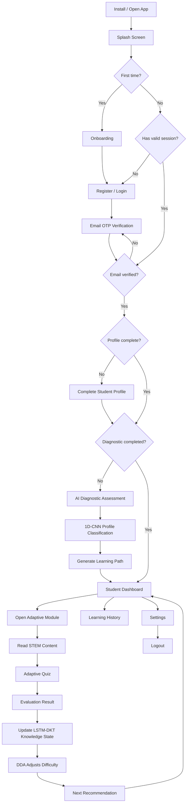
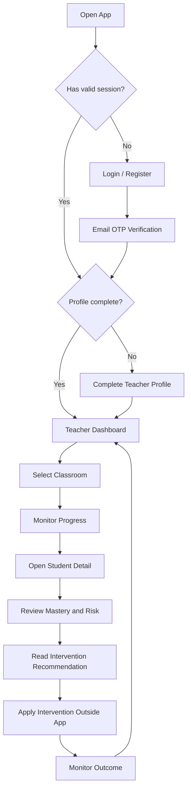
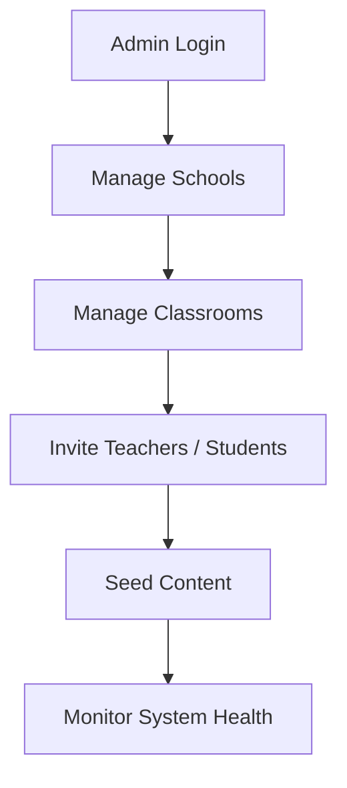
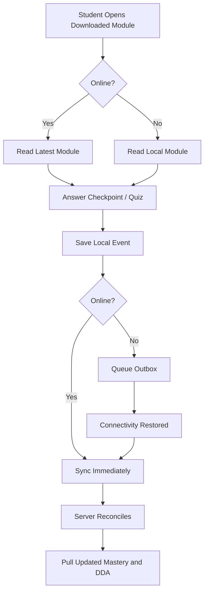
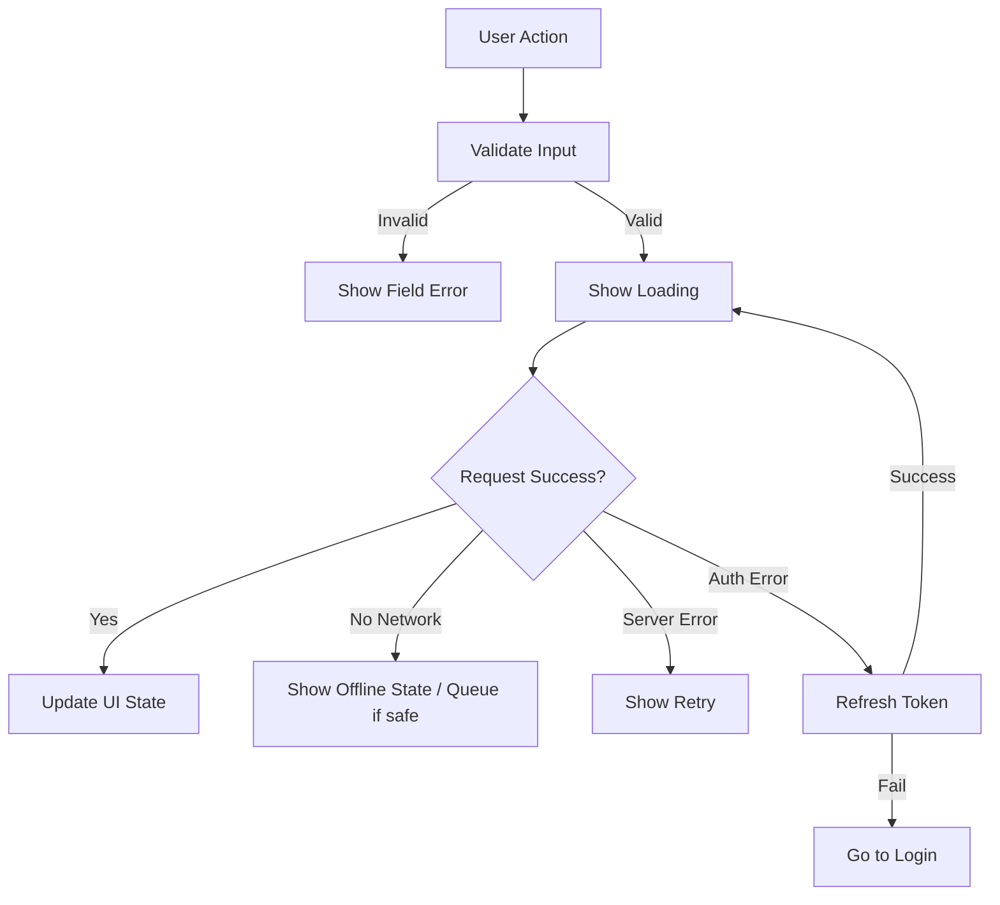

# User Flow

## 1. Student End-to-End Flow

```mermaid
flowchart TD
  A["Install / Open App"] --> B["Splash Screen"]
  B --> C{"First time?"}
  C -->|Yes| D["Onboarding"]
  C -->|No| E{"Has valid session?"}
  D --> F["Register / Login"]
  E -->|No| F
  E -->|Yes| G{"Email verified?"}
  F --> H["Email OTP Verification"]
  H --> G
  G -->|No| H
  G -->|Yes| I{"Profile complete?"}
  I -->|No| J["Complete Student Profile"]
  I -->|Yes| K{"Diagnostic completed?"}
  J --> K
  K -->|No| L["AI Diagnostic Assessment"]
  L --> M["1D-CNN Profile Classification"]
  M --> N["Generate Learning Path"]
  K -->|Yes| O["Student Dashboard"]
  N --> O
  O --> P["Open Adaptive Module"]
  P --> Q["Read STEM Content"]
  Q --> R["Adaptive Quiz"]
  R --> S["Evaluation Result"]
  S --> T["Update LSTM-DKT Knowledge State"]
  T --> U["DDA Adjusts Difficulty"]
  U --> V["Next Recommendation"]
  V --> O
  O --> W["Learning History"]
  O --> X["Settings"]
  X --> Y["Logout"]
```

## 2. Teacher End-to-End Flow

```mermaid
flowchart TD
  A["Open App"] --> B{"Has valid session?"}
  B -->|No| C["Login / Register"]
  C --> D["Email OTP Verification"]
  B -->|Yes| E{"Profile complete?"}
  D --> E
  E -->|No| F["Complete Teacher Profile"]
  E -->|Yes| G["Teacher Dashboard"]
  F --> G
  G --> H["Select Classroom"]
  H --> I["Monitor Progress"]
  I --> J["Open Student Detail"]
  J --> K["Review Mastery and Risk"]
  K --> L["Read Intervention Recommendation"]
  L --> M["Apply Intervention Outside App"]
  M --> N["Monitor Outcome"]
  N --> G
```

## 3. Admin Support Flow

```mermaid
flowchart TD
  A["Admin Login"] --> B["Manage Schools"]
  B --> C["Manage Classrooms"]
  C --> D["Invite Teachers / Students"]
  D --> E["Seed Content"]
  E --> F["Monitor System Health"]
```

## 4. Offline Flow

```mermaid
flowchart TD
  A["Student Opens Downloaded Module"] --> B{"Online?"}
  B -->|Yes| C["Read Latest Module"]
  B -->|No| D["Read Local Module"]
  C --> E["Answer Checkpoint / Quiz"]
  D --> E
  E --> F["Save Local Event"]
  F --> G{"Online?"}
  G -->|No| H["Queue Outbox"]
  G -->|Yes| I["Sync Immediately"]
  H --> J["Connectivity Restored"]
  J --> I
  I --> K["Server Reconciles"]
  K --> L["Pull Updated Mastery and DDA"]
```

## 5. Failure and Retry Flow

```mermaid
flowchart TD
  A["User Action"] --> B["Validate Input"]
  B -->|Invalid| C["Show Field Error"]
  B -->|Valid| D["Show Loading"]
  D --> E{"Request Success?"}
  E -->|Yes| F["Update UI State"]
  E -->|No Network| G["Show Offline State / Queue if safe"]
  E -->|Server Error| H["Show Retry"]
  E -->|Auth Error| I["Refresh Token"]
  I -->|Success| D
  I -->|Fail| J["Go to Login"]
```
