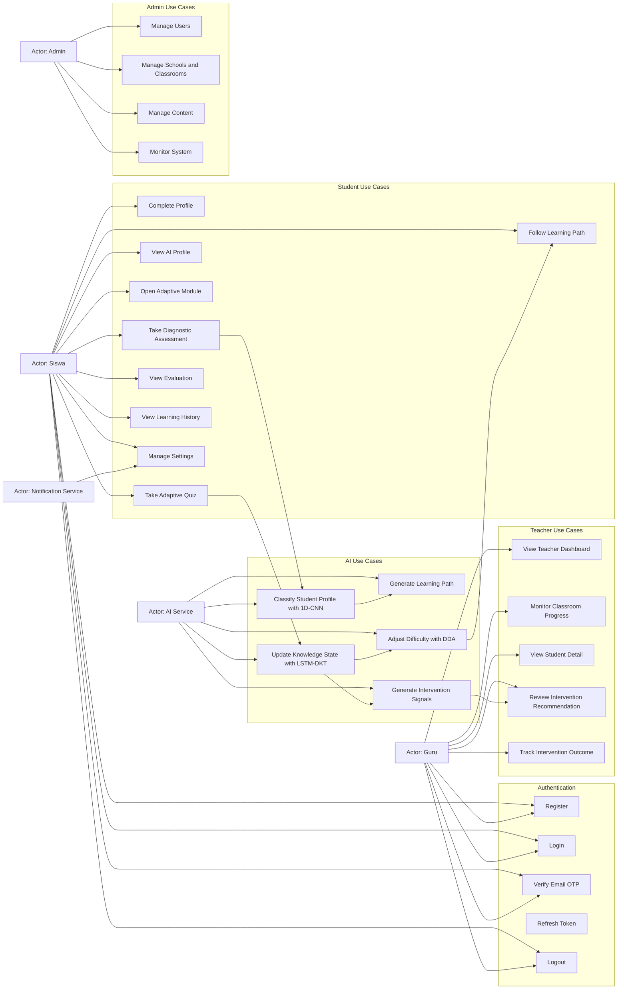

# Use Case Diagram

## Use Case Notes

- `Classify Student Profile` harus menyimpan confidence dan model version.
- `Update Knowledge State` berjalan setelah quiz atau checkpoint penting.
- `Adjust Difficulty` tidak boleh memakai satu sinyal saja; minimal mempertimbangkan correctness, response time, mastery probability, dan recent streak.
- `Review Intervention Recommendation` harus menyertakan rationale yang dapat dipahami guru.
