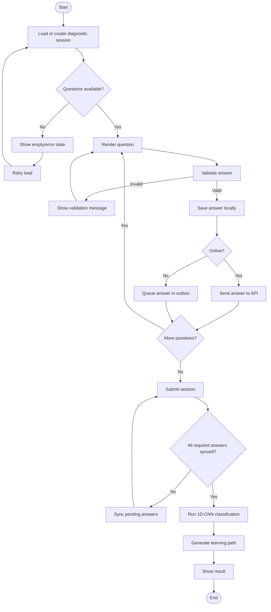
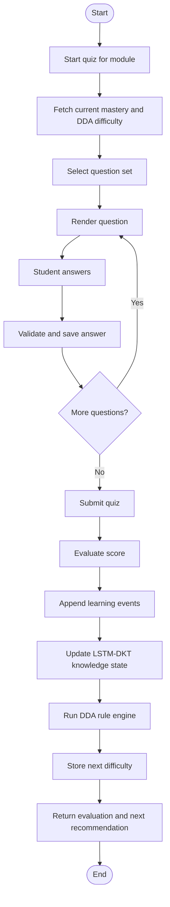
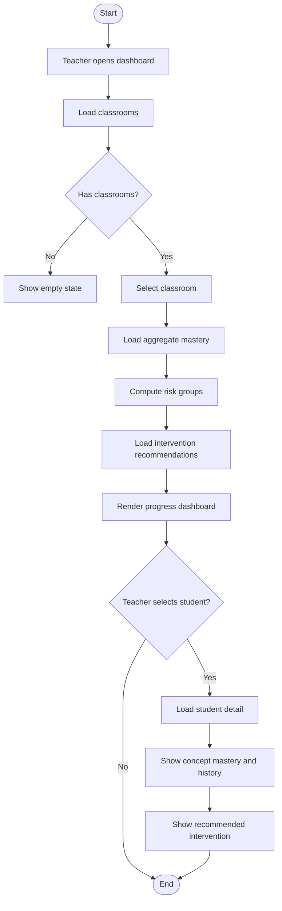

# Activity Diagram

## 1. Diagnostic Assessment Activity

```mermaid
flowchart TD
  A([Start]) --> B["Load or create diagnostic session"]
  B --> C{"Questions available?"}
  C -->|No| D["Show empty/error state"]
  D --> E["Retry load"]
  E --> B
  C -->|Yes| F["Render question"]
  F --> G["Validate answer"]
  G -->|Invalid| H["Show validation message"]
  H --> F
  G -->|Valid| I["Save answer locally"]
  I --> J{"Online?"}
  J -->|Yes| K["Send answer to API"]
  J -->|No| L["Queue answer in outbox"]
  K --> M{"More questions?"}
  L --> M
  M -->|Yes| F
  M -->|No| N["Submit session"]
  N --> O{"All required answers synced?"}
  O -->|No| P["Sync pending answers"]
  P --> N
  O -->|Yes| Q["Run 1D-CNN classification"]
  Q --> R["Generate learning path"]
  R --> S["Show result"]
  S --> T([End])
```

## 2. Adaptive Quiz Activity

```mermaid
flowchart TD
  A([Start]) --> B["Start quiz for module"]
  B --> C["Fetch current mastery and DDA difficulty"]
  C --> D["Select question set"]
  D --> E["Render question"]
  E --> F["Student answers"]
  F --> G["Validate and save answer"]
  G --> H{"More questions?"}
  H -->|Yes| E
  H -->|No| I["Submit quiz"]
  I --> J["Evaluate score"]
  J --> K["Append learning events"]
  K --> L["Update LSTM-DKT knowledge state"]
  L --> M["Run DDA rule engine"]
  M --> N["Store next difficulty"]
  N --> O["Return evaluation and next recommendation"]
  O --> P([End])
```

## 3. Teacher Monitoring Activity

```mermaid
flowchart TD
  A([Start]) --> B["Teacher opens dashboard"]
  B --> C["Load classrooms"]
  C --> D{"Has classrooms?"}
  D -->|No| E["Show empty state"]
  D -->|Yes| F["Select classroom"]
  F --> G["Load aggregate mastery"]
  G --> H["Compute risk groups"]
  H --> I["Load intervention recommendations"]
  I --> J["Render progress dashboard"]
  J --> K{"Teacher selects student?"}
  K -->|No| L([End])
  K -->|Yes| M["Load student detail"]
  M --> N["Show concept mastery and history"]
  N --> O["Show recommended intervention"]
  O --> L
```
