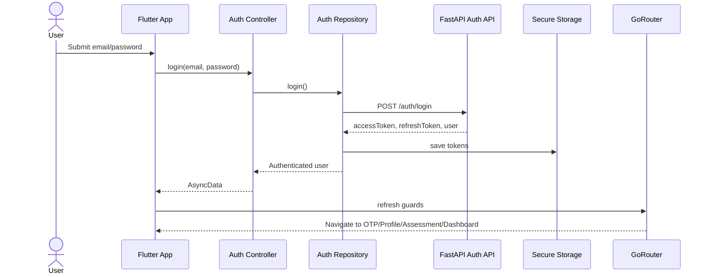
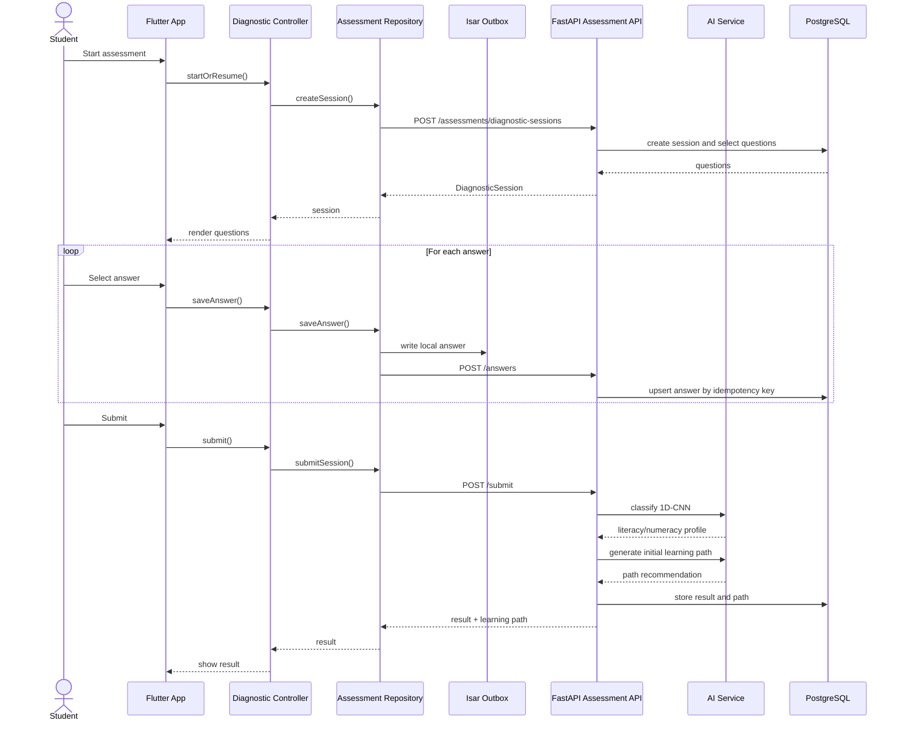
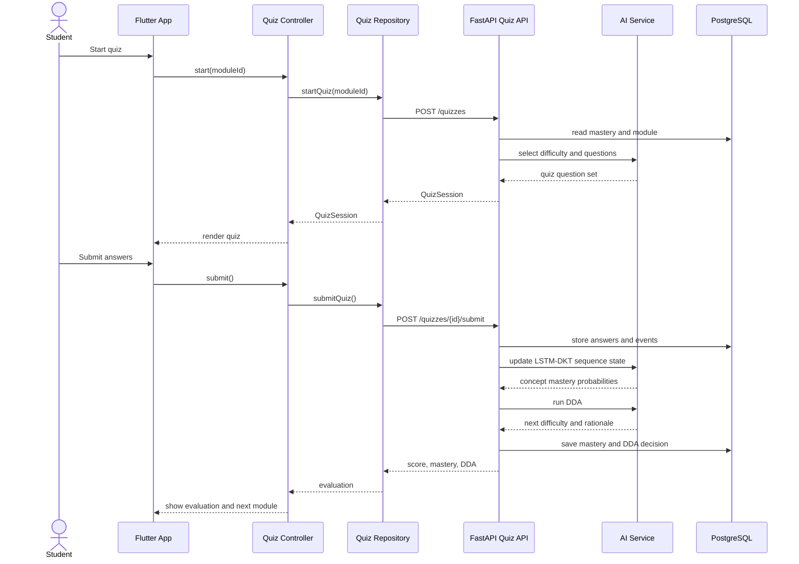
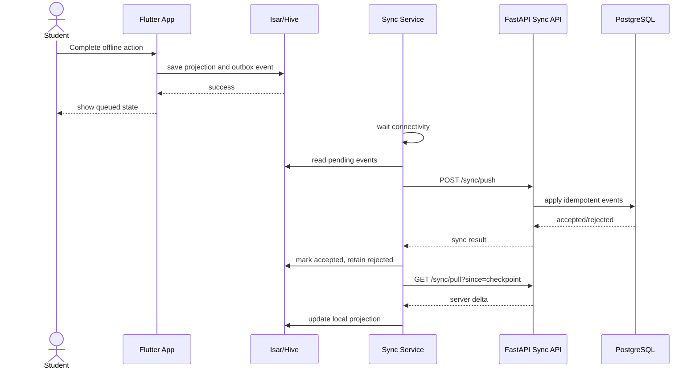

# Sequence Diagram

## 1. Login and Route Guard

```mermaid
sequenceDiagram
  actor User
  participant App as Flutter App
  participant AuthController as Auth Controller
  participant AuthRepo as Auth Repository
  participant API as FastAPI Auth API
  participant Vault as Secure Storage
  participant Router as GoRouter

  User->>App: Submit email/password
  App->>AuthController: login(email, password)
  AuthController->>AuthRepo: login()
  AuthRepo->>API: POST /auth/login
  API-->>AuthRepo: accessToken, refreshToken, user
  AuthRepo->>Vault: save tokens
  AuthRepo-->>AuthController: Authenticated user
  AuthController-->>App: AsyncData
  App->>Router: refresh guards
  Router-->>App: Navigate to OTP/Profile/Assessment/Dashboard
```

## 2. Diagnostic Assessment to Learning Path

```mermaid
sequenceDiagram
  actor Student
  participant App as Flutter App
  participant Controller as Diagnostic Controller
  participant Repo as Assessment Repository
  participant Local as Isar Outbox
  participant API as FastAPI Assessment API
  participant AI as AI Service
  participant DB as PostgreSQL

  Student->>App: Start assessment
  App->>Controller: startOrResume()
  Controller->>Repo: createSession()
  Repo->>API: POST /assessments/diagnostic-sessions
  API->>DB: create session and select questions
  DB-->>API: questions
  API-->>Repo: DiagnosticSession
  Repo-->>Controller: session
  Controller-->>App: render questions

  loop For each answer
    Student->>App: Select answer
    App->>Controller: saveAnswer()
    Controller->>Repo: saveAnswer()
    Repo->>Local: write local answer
    Repo->>API: POST /answers
    API->>DB: upsert answer by idempotency key
  end

  Student->>App: Submit
  App->>Controller: submit()
  Controller->>Repo: submitSession()
  Repo->>API: POST /submit
  API->>AI: classify 1D-CNN
  AI-->>API: literacy/numeracy profile
  API->>AI: generate initial learning path
  AI-->>API: path recommendation
  API->>DB: store result and path
  API-->>Repo: result + learning path
  Repo-->>Controller: result
  Controller-->>App: show result
```

## 3. Quiz, LSTM-DKT, and DDA

```mermaid
sequenceDiagram
  actor Student
  participant App as Flutter App
  participant Quiz as Quiz Controller
  participant Repo as Quiz Repository
  participant API as FastAPI Quiz API
  participant AI as AI Service
  participant DB as PostgreSQL

  Student->>App: Start quiz
  App->>Quiz: start(moduleId)
  Quiz->>Repo: startQuiz(moduleId)
  Repo->>API: POST /quizzes
  API->>DB: read mastery and module
  API->>AI: select difficulty and questions
  AI-->>API: quiz question set
  API-->>Repo: QuizSession
  Repo-->>Quiz: QuizSession
  Quiz-->>App: render quiz

  Student->>App: Submit answers
  App->>Quiz: submit()
  Quiz->>Repo: submitQuiz()
  Repo->>API: POST /quizzes/{id}/submit
  API->>DB: store answers and events
  API->>AI: update LSTM-DKT sequence state
  AI-->>API: concept mastery probabilities
  API->>AI: run DDA
  AI-->>API: next difficulty and rationale
  API->>DB: save mastery and DDA decision
  API-->>Repo: score, mastery, DDA
  Repo-->>Quiz: evaluation
  Quiz-->>App: show evaluation and next module
```

## 4. Offline Sync

```mermaid
sequenceDiagram
  actor Student
  participant App as Flutter App
  participant Local as Isar/Hive
  participant Sync as Sync Service
  participant API as FastAPI Sync API
  participant DB as PostgreSQL

  Student->>App: Complete offline action
  App->>Local: save projection and outbox event
  Local-->>App: success
  App-->>Student: show queued state
  Sync->>Sync: wait connectivity
  Sync->>Local: read pending events
  Sync->>API: POST /sync/push
  API->>DB: apply idempotent events
  DB-->>API: accepted/rejected
  API-->>Sync: sync result
  Sync->>Local: mark accepted, retain rejected
  Sync->>API: GET /sync/pull?since=checkpoint
  API-->>Sync: server delta
  Sync->>Local: update local projection
```
