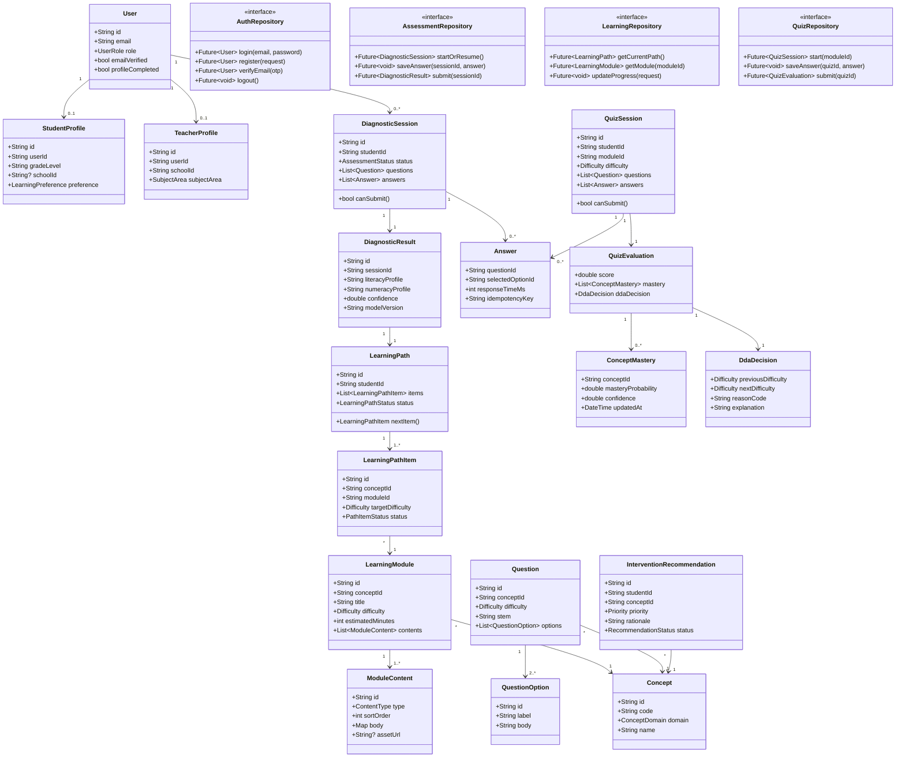

# Class Diagram

Diagram ini menggambarkan struktur domain inti. Implementasi final dapat memecah class menjadi file berbeda sesuai feature-first architecture.

## Implementation Notes

- Domain entities harus immutable di Flutter menggunakan Freezed.
- DTO memakai Json Serializable dan tidak boleh dipakai langsung di UI.
- Entity method hanya boleh berisi logic domain ringan, bukan network/storage.
- Repository contract berada di domain; implementation berada di data.
