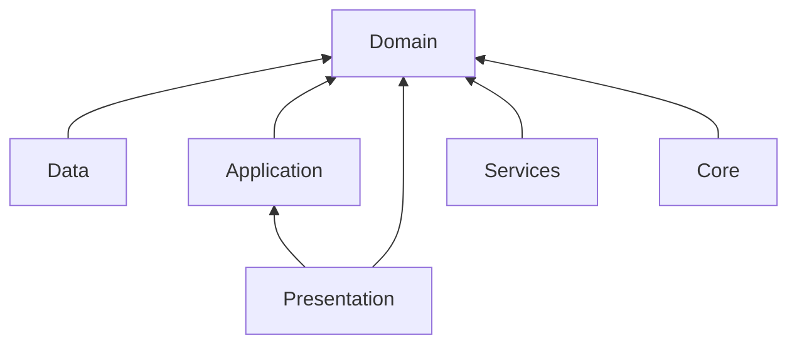

# Folder Structure

Struktur ini mengikuti feature-first Clean Architecture. UI tidak menyimpan business logic; semua keputusan bisnis berada di use case, domain service, repository, atau service layer.

## Monorepo Target

```text
litera_ai/
  apps/
    mobile/
      android/
      ios/
      lib/
      test/
      integration_test/
      assets/
      pubspec.yaml
    backend/
      app/
      alembic/
      tests/
      pyproject.toml
    ai/
      training/
      inference/
      notebooks/
      models/
  packages/
    litera_api_contracts/
    litera_design_tokens/
  infra/
    docker/
    nginx/
    github-actions/
  docs/
```

## Flutter App Structure

```text
apps/mobile/lib/
  main.dart
  bootstrap.dart
  app/
    app.dart
    router/
      app_router.dart
      route_guards.dart
      route_names.dart
    theme/
      app_theme.dart
      color_schemes.dart
      typography.dart
    localization/
  core/
    config/
      app_config.dart
      environment.dart
    error/
      app_exception.dart
      failure.dart
      error_mapper.dart
    network/
      dio_provider.dart
      auth_interceptor.dart
      retry_interceptor.dart
      certificate_pinning.dart
    security/
      secure_token_store.dart
      aes_cipher.dart
    storage/
      isar_provider.dart
      hive_provider.dart
      cache_policy.dart
    logging/
      app_logger.dart
      analytics_logger.dart
    sync/
      sync_service.dart
      outbox_queue.dart
      connectivity_observer.dart
  shared/
    widgets/
      atoms/
      molecules/
      organisms/
      layouts/
    extensions/
    validators/
    constants/
    utils/
  services/
    analytics/
    crash_reporting/
    notifications/
    local_notifications/
    ai_inference/
  features/
    auth/
      presentation/
        screens/
        widgets/
        controllers/
      application/
        use_cases/
        providers/
      domain/
        entities/
        repositories/
        value_objects/
      data/
        datasources/
        dtos/
        mappers/
        repositories/
    onboarding/
    profile/
    diagnostic_assessment/
    learning_path/
    adaptive_module/
    adaptive_quiz/
    student_dashboard/
    teacher_dashboard/
    learning_history/
    settings/
```

## Backend Structure

```text
apps/backend/app/
  main.py
  api/
    v1/
      routers/
      dependencies/
      schemas/
  core/
    config.py
    security.py
    logging.py
    rate_limit.py
    errors.py
  domain/
    users/
    assessment/
    learning/
    ai/
    teacher/
  application/
    services/
    use_cases/
  infrastructure/
    db/
      models/
      repositories/
      session.py
    redis/
    email/
    storage/
    workers/
  ai/
    inference/
    feature_extraction/
    dda/
  tests/
```

## AI Structure

```text
apps/ai/
  training/
    datasets/
    preprocessing/
    cnn_classifier/
    lstm_dkt/
    evaluation/
  inference/
    model_loader.py
    classifier_service.py
    dkt_service.py
    dda_engine.py
  models/
    registry.json
    cnn/
    dkt/
  notebooks/
```

## Naming Rules

- Feature folder memakai snake_case.
- Dart class memakai PascalCase.
- Provider diberi suffix `Provider`.
- Controller/notifier diberi suffix `Controller` atau `Notifier`.
- Use case memakai kata kerja: `LoginUser`, `SubmitDiagnosticAssessment`.
- Repository contract berada di domain; implementation berada di data.
- DTO tidak bocor ke domain atau presentation.

## Generated Files

Generated files tidak diedit manual:

- `*.freezed.dart`
- `*.g.dart`
- `*.gen.dart`
- Isar generated schema files
- Flutter Gen generated assets

## Dependency Direction



Dependency inward only:

- Presentation boleh mengenal Application dan Domain.
- Application boleh mengenal Domain.
- Data mengimplementasikan contract Domain.
- Domain tidak mengenal Flutter, Dio, Isar, Hive, FastAPI, atau Firebase.

## Feature Module Template

```text
features/example/
  presentation/
    screens/example_screen.dart
    widgets/example_card.dart
    controllers/example_controller.dart
  application/
    use_cases/load_example.dart
    providers/example_providers.dart
  domain/
    entities/example.dart
    repositories/example_repository.dart
  data/
    datasources/example_remote_datasource.dart
    datasources/example_local_datasource.dart
    dtos/example_dto.dart
    mappers/example_mapper.dart
    repositories/example_repository_impl.dart
```

## Implementation Rule

Setiap fitur baru harus memiliki minimal:

- Domain entity atau value object jika ada konsep bisnis.
- Repository contract jika mengambil/menyimpan data.
- Use case untuk aksi bisnis.
- Riverpod provider untuk dependency graph.
- Screen/widget tanpa business logic.
- Unit test untuk use case dan repository mapper.
