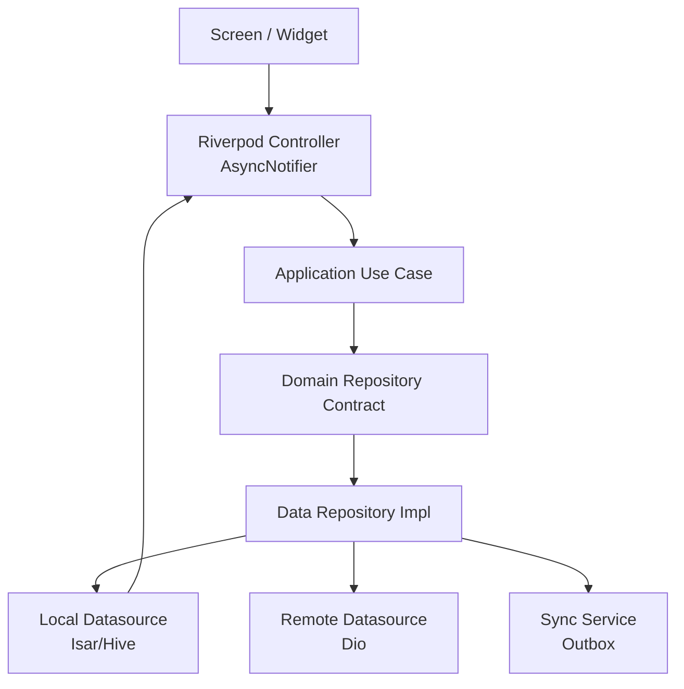
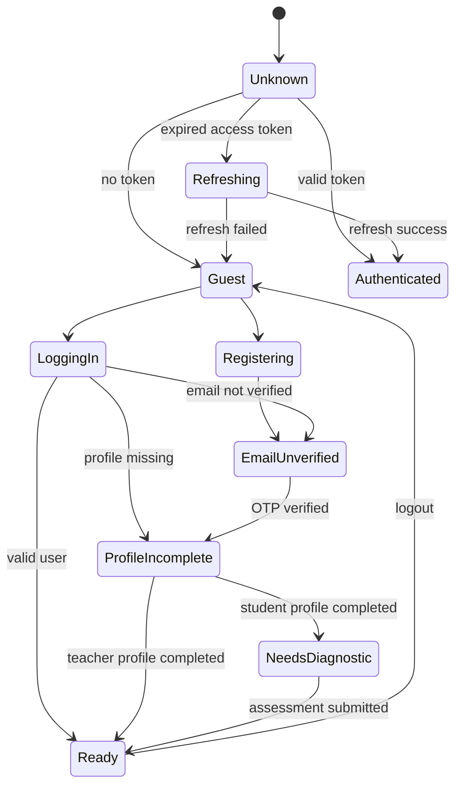
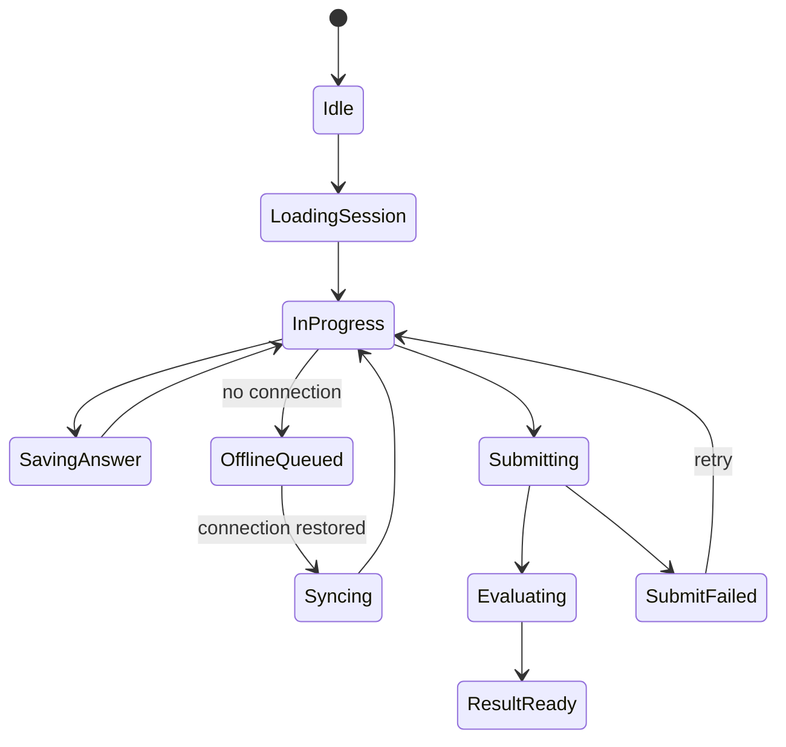
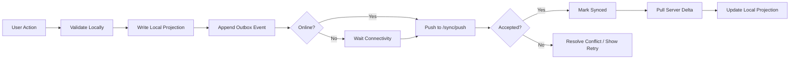

# State Management Flow

## 1. State Management Choice

LITERA-AI memakai Riverpod sebagai dependency injection dan state management utama. Pola default:

- `Provider` untuk dependency stateless.
- `FutureProvider` untuk read-only async data ringan.
- `StreamProvider` untuk WebSocket/live progress.
- `AsyncNotifier` untuk screen-level orchestration.
- `StateNotifier` hanya jika butuh state machine kompleks.

## 2. State Layers

## 3. Async State Standard

Setiap screen async harus memetakan state berikut:

| State | UI Behavior |
| --- | --- |
| Loading | Skeleton atau progress indicator ringan. |
| Empty | Pesan empty spesifik dan aksi utama. |
| Data | Render data dengan pagination/lazy loading. |
| Error recoverable | Error message, retry button, logging. |
| Error auth | Route ke login atau refresh token flow. |
| Offline | Badge offline, local data, queued action indicator. |

## 4. Global App State

| State | Source | Consumer |
| --- | --- | --- |
| SessionState | Secure token store + `/me` | Route guards, auth interceptor. |
| OnboardingState | Hive app flags | Route guard. |
| ProfileCompletionState | `/me` + local projection | Route guard. |
| ConnectivityState | Connectivity observer | Sync, offline banner. |
| ThemeState | Hive settings | App theme. |
| NotificationPermissionState | OS permission + FCM | Settings, onboarding reminder. |

## 5. Auth State Machine

## 6. Diagnostic Assessment State

## 7. Offline Sync State

## 8. Provider Organization

Provider per feature:

- `authRepositoryProvider`
- `loginUserProvider`
- `authControllerProvider`
- `diagnosticRepositoryProvider`
- `diagnosticControllerProvider`
- `learningPathControllerProvider`
- `teacherDashboardControllerProvider`

Cross-cutting providers:

- `dioProvider`
- `secureTokenStoreProvider`
- `isarProvider`
- `hiveProvider`
- `syncServiceProvider`
- `analyticsServiceProvider`
- `crashReporterProvider`
- `connectivityProvider`

## 9. Rebuild Rules

- Gunakan `select` untuk field kecil yang sering berubah.
- Hindari provider global untuk data screen yang tidak perlu global.
- Dispose controller otomatis dengan `autoDispose` untuk screen transient.
- Keep-alive hanya untuk session, theme, config, router, dan cache penting.
- Parsing JSON besar dijalankan di isolate jika mengganggu frame time.

## 10. Error Handling Flow

1. Datasource menangkap error teknis.
2. Repository memetakan error ke `Failure`.
3. Use case menentukan apakah error bisa di-retry.
4. Controller mengubah state menjadi `AsyncError` atau custom view state.
5. UI menampilkan pesan manusiawi dan aksi retry.
6. Logger mencatat error dengan request id, tanpa PII.

## 11. Analytics Events

Event state penting:

- `auth_login_success`
- `profile_completed`
- `diagnostic_started`
- `diagnostic_submitted`
- `learning_path_generated`
- `module_opened`
- `quiz_submitted`
- `dda_decision_applied`
- `teacher_dashboard_opened`
- `offline_sync_completed`
