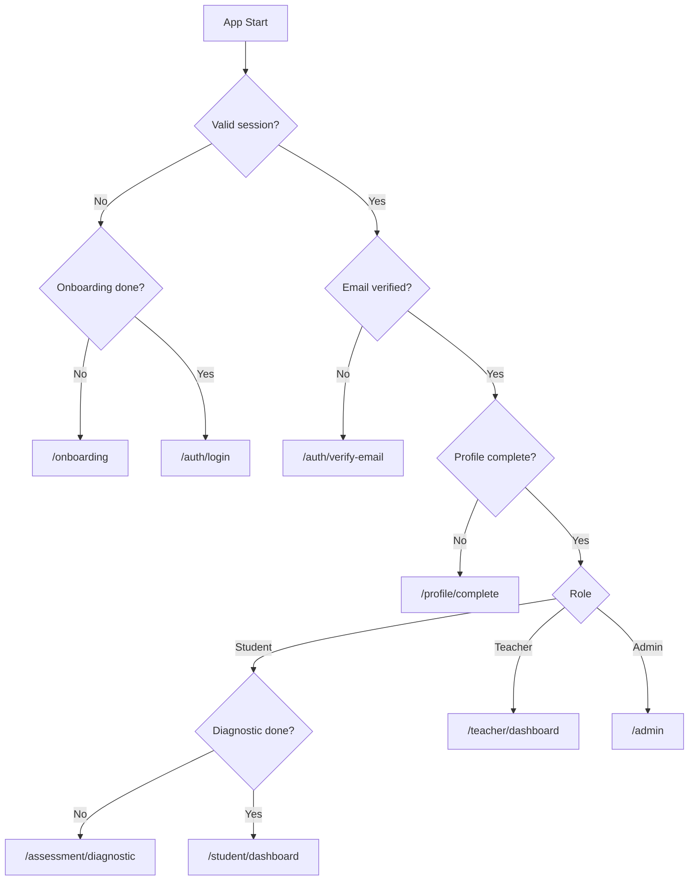
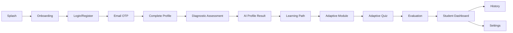
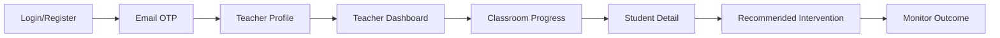

# Navigation Flow

## 1. Router Choice

GoRouter dipakai untuk declarative routing, deep link readiness, dan guard berdasarkan session/profile/assessment state.

## 2. Route Map

| Route | Screen | Guard |
| --- | --- | --- |
| `/splash` | SplashScreen | None |
| `/onboarding` | OnboardingScreen | Guest only |
| `/auth/login` | LoginScreen | Guest only |
| `/auth/register` | RegisterScreen | Guest only |
| `/auth/verify-email` | VerifyEmailOtpScreen | Auth, email unverified |
| `/profile/complete` | CompleteProfileScreen | Auth, email verified |
| `/assessment/diagnostic` | DiagnosticAssessmentScreen | Student, profile complete |
| `/assessment/result` | DiagnosticResultScreen | Student, assessment submitted |
| `/student` | StudentShell | Student ready |
| `/student/dashboard` | StudentDashboardScreen | Student ready |
| `/student/learning-path` | LearningPathScreen | Student ready |
| `/student/modules/:moduleId` | ModuleDetailScreen | Student ready |
| `/student/quizzes/:moduleId/start` | QuizScreen | Student ready |
| `/student/history` | LearningHistoryScreen | Student ready |
| `/teacher` | TeacherShell | Teacher ready |
| `/teacher/dashboard` | TeacherDashboardScreen | Teacher ready |
| `/teacher/classes/:classroomId` | ClassroomProgressScreen | Teacher ready |
| `/teacher/students/:studentId` | StudentProgressDetailScreen | Teacher ready |
| `/settings` | SettingsScreen | Auth |

## 3. Route Guard Decision Tree

## 4. Main Student Flow

## 5. Main Teacher Flow

## 6. Navigation Shells

Student shell tabs:

- Dashboard.
- Learning Path.
- History.
- Settings.

Teacher shell tabs:

- Dashboard.
- Classes.
- Interventions.
- Settings.

## 7. Deep Links

Supported after MVP:

- `literaai://module/{moduleId}`
- `literaai://quiz/{moduleId}`
- `literaai://teacher/classroom/{classroomId}`
- `literaai://settings/notifications`

Deep link guard must redirect safely if user is not authorized.

## 8. Back Navigation Rules

- Splash cannot be returned to.
- Login/Register can switch freely.
- OTP back returns to login only after confirmation.
- Diagnostic assessment blocks accidental back with save/resume prompt.
- Quiz blocks accidental back with save/resume prompt.
- Dashboard root exits app on Android back after confirmation or double-back pattern.

## 9. Error Routes

- `/error/offline` optional full-screen fallback for first-load failure.
- `/error/forbidden` for RBAC violation.
- `/error/not-found` for missing resources.
- Inline errors preferred for recoverable list/detail failures.
