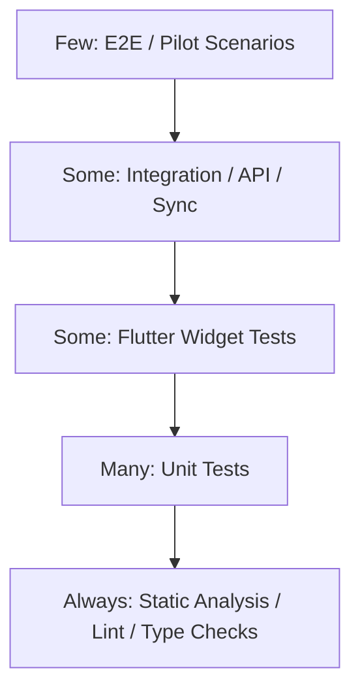

# Testing Strategy

## 1. Testing Goals

- Validate correctness of learning flows.
- Prevent regressions in state management and sync.
- Verify security controls.
- Measure performance on low-end devices.
- Evaluate AI quality and pedagogical effectiveness.
- Ensure accessibility and usability for students and teachers.

## 2. Test Pyramid

## 3. Flutter Tests

| Test Type | Tools | Coverage |
| --- | --- | --- |
| Static analysis | flutter analyze, flutter lints | Style, type safety, lint policy. |
| Unit tests | flutter_test, mocktail | Use cases, validators, mappers, DDA client logic. |
| Provider tests | Riverpod ProviderContainer | Controller state transitions. |
| Widget tests | flutter_test | Loading, empty, error, retry, offline, success UI. |
| Golden tests | golden_toolkit or equivalent | Critical screens in light/dark mode. |
| Integration tests | integration_test | Auth, assessment, quiz, offline sync happy path. |
| Performance tests | Flutter DevTools, integration profiling | Startup, frame timing, memory. |

## 4. Backend Tests

| Test Type | Tools | Coverage |
| --- | --- | --- |
| Static/type | ruff, mypy/pyright where feasible | Code quality and typing. |
| Unit | pytest | Services, validators, DDA rules. |
| API integration | pytest + httpx | Auth, assessment, learning, quiz, teacher APIs. |
| DB migration | Alembic migration test | Upgrade/downgrade where supported, schema validity. |
| Security | dependency scan, custom auth tests | RBAC, token refresh, rate limit, input validation. |
| Load smoke | k6/Locust optional | p95 API latency and rate limit behavior. |

## 5. AI Tests

| Area | Test |
| --- | --- |
| Data validation | Schema checks, missing values, distribution drift. |
| Training reproducibility | Fixed seed, saved config, model checksum. |
| Model metrics | F1, AUC, confusion matrix, calibration. |
| Baseline comparison | Compare against simple baseline before claiming improvement. |
| Inference contract | Same input schema returns expected output shape/range. |
| Latency | Measure p50/p95 inference time. |
| Regression | New model must pass metric threshold before activation. |
| Bias/fairness | Evaluate across available demographic/grade slices with consent. |

## 6. Security Testing

Checklist:

- Password policy validation.
- OTP brute-force rate limiting.
- Login rate limiting.
- Refresh token rotation and reuse detection.
- Logout revocation.
- RBAC: student cannot access teacher data.
- Teacher cannot access unrelated classroom.
- SQL injection attempts rejected.
- XSS payload in content sanitized for any rich text surface.
- Certificate pinning failure path tested.
- Secure storage used for tokens.
- Local sensitive cache encrypted.

## 7. Offline Sync Testing

Scenarios:

- Save answer offline, reconnect, sync accepted.
- Duplicate event with same idempotency key ignored.
- Event conflict returns actionable error.
- Pull delta updates local projection.
- App restart with pending outbox resumes sync.
- Long offline period does not lose events.

## 8. Accessibility Testing

- Screen reader navigation for auth, assessment, quiz.
- Text scale 200%.
- Contrast in light/dark mode.
- Focus order.
- Tap target size.
- Error message semantics.
- Reduced motion.

## 9. Performance Testing

Targets:

- Cold startup p95 < 2 seconds.
- Frame build/raster within 16 ms budget for common scroll surfaces.
- No obvious memory leak after repeated module/quiz navigation.
- API normal endpoint p95 < 500 ms in staging.
- AI inference target <= 200 ms benchmark.

Device matrix:

- Android 8 low-end, RAM 2GB.
- Android current mid-range.
- iOS 15 supported device.
- iOS current device/simulator.

## 10. User Acceptance Testing

Student UAT:

- Can register and verify email.
- Can complete profile.
- Can finish diagnostic assessment without confusion.
- Understands result and next recommendation.
- Can complete module and quiz.

Teacher UAT:

- Can find classroom progress quickly.
- Can identify at-risk students.
- Understands recommendation rationale.
- Can monitor progress after intervention.

## 11. Pilot Evaluation

Metrics:

- SUS >= 70.
- Completion rate for diagnostic assessment.
- Module completion rate.
- Quiz retry rate.
- Pre-test/post-test improvement target >= 15%.
- Teacher perceived usefulness.
- Crash-free sessions >= 99.5%.

## 12. CI/CD Quality Gates

Pull request must pass:

- Flutter analyze.
- Flutter unit/widget tests.
- Backend lint and tests.
- OpenAPI schema validation.
- Migration check.
- Secret scan.
- Dependency vulnerability scan.

Release candidate must pass:

- Integration tests.
- Performance smoke.
- Accessibility checklist.
- Security checklist.
- Model evaluation report if model changed.

## 13. Test Data

- Use synthetic users and classes for automated tests.
- Do not commit real student data.
- Anonymized pilot exports only.
- Stable fixtures for assessment and quiz flows.

## 14. Bug Severity

| Severity | Definition |
| --- | --- |
| Critical | Data loss, auth bypass, app unusable, privacy breach. |
| High | Main learning flow blocked, wrong AI result stored, major crash. |
| Medium | Important feature degraded with workaround. |
| Low | Cosmetic or minor copy issue. |
